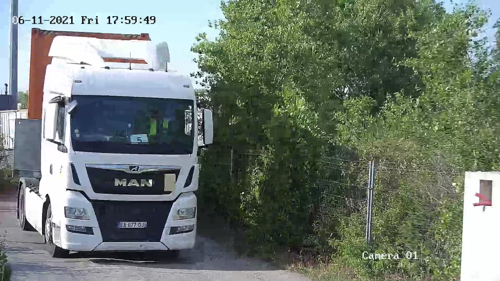
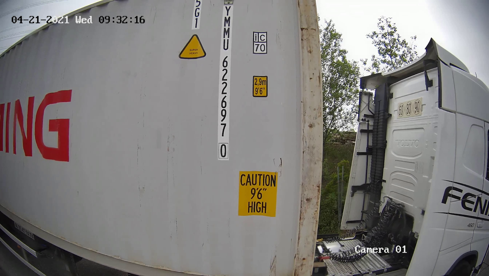

# Motion Detection & Video Recording System


A high-performance **C++ video processing application** designed to monitor RTSP camera streams, detect motion events, and efficiently record or stream video clips. This project demonstrates a robust implementation of **real-time computer vision pipelines**, **multithreading**, and **containerized deployment**.

## 🚀 Quick Start

Get the system running in under 2 minutes using Docker.

```bash
# Start the application and emulated cameras
make up

# Stop the application
make down
```

This will launch:

1. Two emulated RTSP camera streams.
2. The Motion Recorder application.
3. Output video saved to `videos/recording.avi`.

---

## 🏗️ Architecture & Technical Highlights

This project showcases **modern C++ software architecture** principles suitable for scalable video surveillance systems.

### Core Components

- **Producer-Consumer Pattern**: Implements a thread-safe `FrameQueue` to decouple frame capture (IO bound) from image processing (CPU bound).
- **GStreamer Pipeline**: Leverages GStreamer for low-latency UDP streaming and efficient video encoding.
- **Motion Detection**: Uses background subtraction concepts to identify relevant footage, optimizing storage by only recording events (mocked for demo purposes).
- **RAII Resource Management**: Ensures thread lifecycle and file handle safety using standard C++17 idioms.

### Tech Stack

- **Language**: C++17
- **Computer Vision**: OpenCV 4.x
- **Multimedia Framework**: GStreamer
- **Build System**: CMake, Make
- **Containerization**: Docker & Docker Compose

## 📷 System Context

The system simulates a 24/7 monitoring station for vehicle access points (e.g., shipping containers or toll booths). To optimize storage and compute resources, the system only processes and records when activity is detected.

The application connects to the emulated cameras via the following RTSP URIs:

- `rtsp://localhost:8554/rail_1_cam_1`: Loops an example video (`videos/train-example.mp4`).
- `rtsp://localhost:8554/rail_1_cam_2`: Secondary view stream.

<p align="center">
  
  
</p>
<p align="center">
  <em>Figure 1: Multi-angle monitoring setup (Frontal & Lateral views)</em>
</p>

## 🛠️ Manual Build & Execution

If you prefer to run without Docker or need to debug locally.

### Prerequisites

- **C++ Compiler**: GCC/Clang supporting C++17.
- **Libraries**: [OpenCV](https://opencv.org/), [GStreamer](https://gstreamer.freedesktop.org/).
- **Tools**: CMake (>= 3.10).

### Build Steps

```bash
# 1. Start ONLY the camera simulators
# Edit docker/docker-compose.yaml to comment out 'motion_detection_app' first
make up

# 2. Compile
mkdir build && cd build
cmake ..
make

# 3. Run
# Usage: ./MotionDetection <camera_uri> <dest_host_ip> <dest_port> <time_to_stop> [<output_path>]
./app/MotionDetection rtsp://localhost:8554/rail_1_cam_1 127.0.0.1 5004 15 ~/Downloads/outvideo.avi
```

### Modes of Operation

1. **File Recording**: Provide an output path (e.g., `~/Downloads/outvideo.avi`) to save the clip locally.
2. **UDP Streaming**: Leave the optional `<output_path>` parameter blank to stream the video via UDP.
   - **Command Example**:
     ```bash
     ./app/MotionDetection rtsp://localhost:8554/rail_1_cam_1 127.0.0.1 5004 20
     ```
   - **View Stream**: Open VLC Player > Media > Open Network Stream > paste `udp://@127.0.0.1:5004`.
   - **Note**: It is desirable to set a higher duration (e.g., 20 seconds) to ensure enough time to connect and view the stream in VLC.

## 🔮 Future Improvements

- **Logging**: Integrate `spdlog` for structured, asynchronous logging.
- **Analytics**: Implement actual OCR/Object Detection.
- **API**: Expose a REST API for configuration and health checks.
