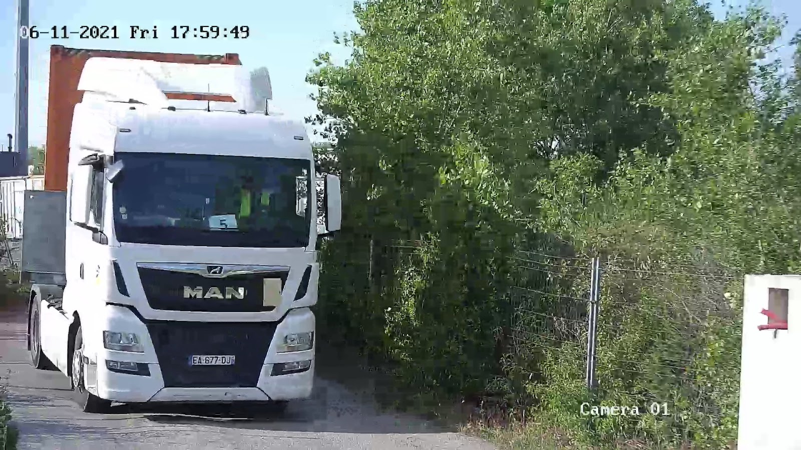
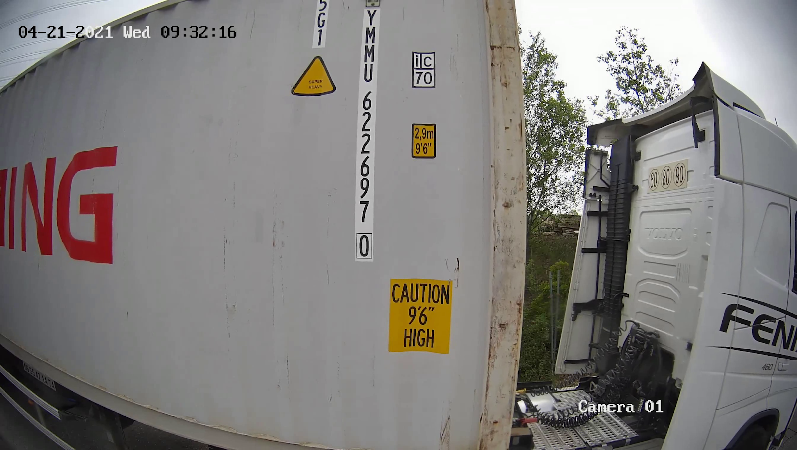

# C++ Cameras projects

## Context

A camera wants to monitor their inputs and outputs from a given access point. Everytime that a vehicle passes through this point, we want to process a short video clip of the transit in order to provide in real time the relevant information such as license plate, shipping container code, etc.
The access has to be monitored 24/7, but most of the time there isn't a vehicle passing by, so it's better the camera does not constantly process every frame, in order to avoid wasting computational resources.

## The docker image with the camera

A docker image with two cameras is provided. Both are standard IP cameras, 30 fps. One with a frontal view to capture the license plates, and the other one with a lateral view, ro see the container codes (see Fig. 1).

<table style="padding:10px">
	<tr>
	 	<td align="center"></td>   
		<td align="center"></td>
	</tr>
	<tr>
	 	<td align="center"">Cam A: Frontal view</td>   
		<td align="center">Cam B: Lateral view</td>
	</tr>
	<tr>
	 	<td colspan="2" align="center">Figure 1</td>   
	</tr>
</table>

## The application

The application connects to the emulated cameras via these RSTP uris:

- `rtsp://localhost:8554/rail_1_cam_1`: it executes a loop with an emulated video stored in `videos/train-example.mp4`.
- `rtsp://localhost:8554/rail_1_cam_2`

It connects, records a video and saves it as `/videos/recording.avi`. The program internally uses GStreamer and OpenCV. You can execute it two ways:

1. Using docker.
2. Manually compiling and executing.

## Common pre-requisites

- Install Docker CE (follow [Installation Guide](https://docs.docker.com/engine/install/ubuntu/)).
- Make sure about [post installation step for Docker](https://docs.docker.com/engine/install/linux-postinstall/).

## 1. Execution using docker

1. Just start the docker compose via:

```bash
   $ make up
```

2. Stop docker compose to finish
   ```bash
   $ make down
   ```

An image is provided, but needs access to the Docker Hub repository to access it. In case you can't, you can manually compile the program (see next section), and create the docker image yourself in your local machine with:

```bash
   $ docker build -t motion_detection_app .
```

## 2. Manually compiled execution

This option allows you to specifically choose the output folder and video file name. It also gives you the option to receive the output video in an UDP destination.

### Specific pre-requisites

- Install [OpenCV dependencies](https://docs.opencv.org/4.x/d7/d9f/tutorial_linux_install.html).
- Install [GStreamer dependencies](https://gstreamer.freedesktop.org/documentation/installing/on-linux.html?gi-language=c).

### Procedure

1. Erase `motion_detection_app` image from docker-compose to avoid it to act. Then, start docker compose again as before:

```bash
   $ make up
```

2. Compile the application with cmake:

```bash
$ mkdir build && cmake .. && make
```

3. Launch the program:

```bash
$ cd build && ./app/MotionDetection <camera_uri> <dest_host_ip> <dest_port> <time_to_stop> [<output_path>]
```

For example, you could use the emulated camera uri `rtsp://localhost:8554/rail_1_cam_1`, destination `127.0.0.1:5004`, `15` seconds and `~/Downloads/outvideo.avi` the output video file.

If you would rather stream the output to an UDP destination, just leave blank the optional parameter `<output_path>`. To see the streamed video in your UDP destination, you can download and open VLC Player > Media > Open Network Stream > and paste this URL: `udp://@127.0.0.1:5004`. It's desirable to set a high time (20 seconds, for example), to be able to see it for time enough.

4. Stop docker compose to finish
   ```bash
   $ make down
   ```

## Improvements

- Make use of spdlog library to log
- Use OpenCV to process container data
- Make the example video public and downloadable
